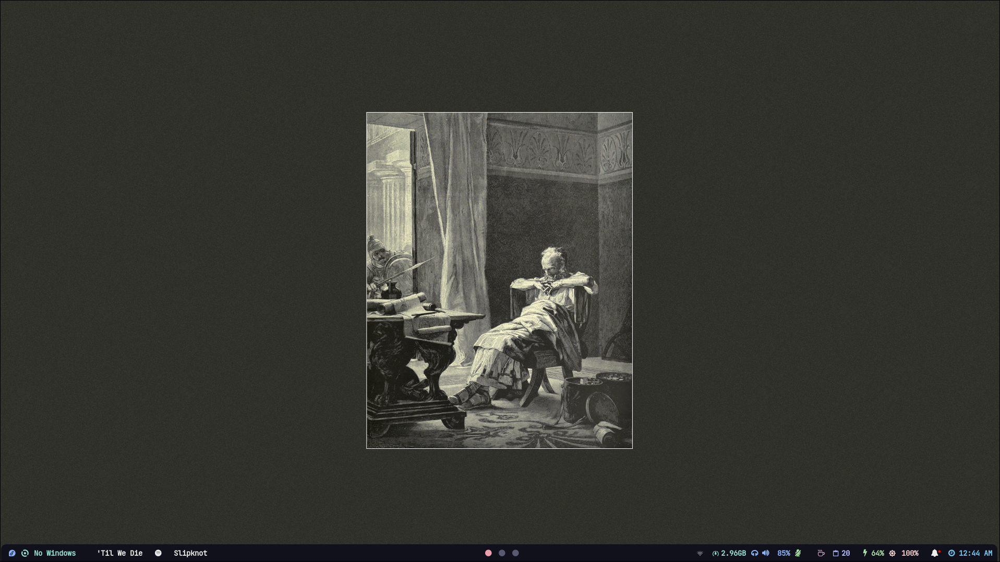
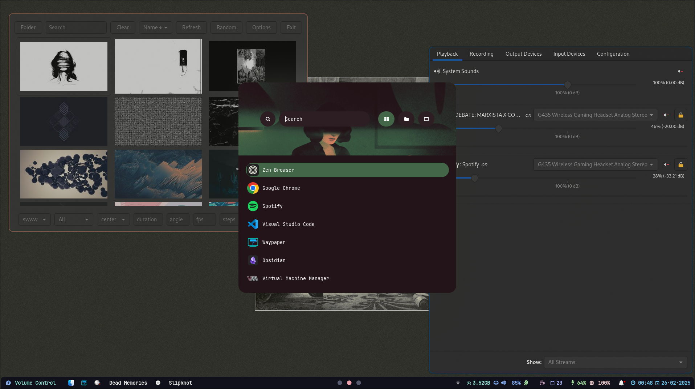
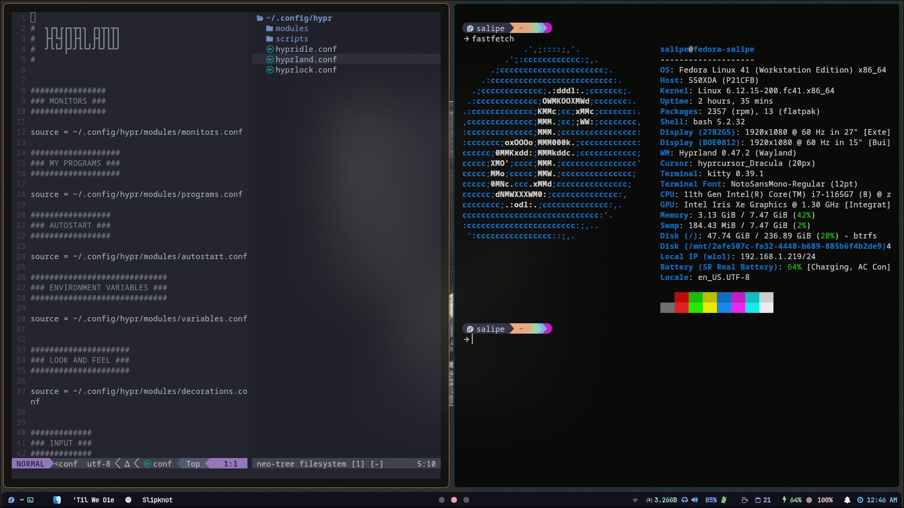
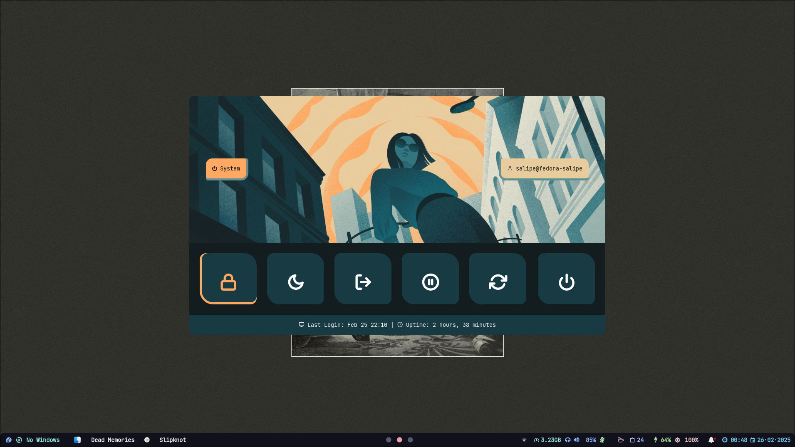
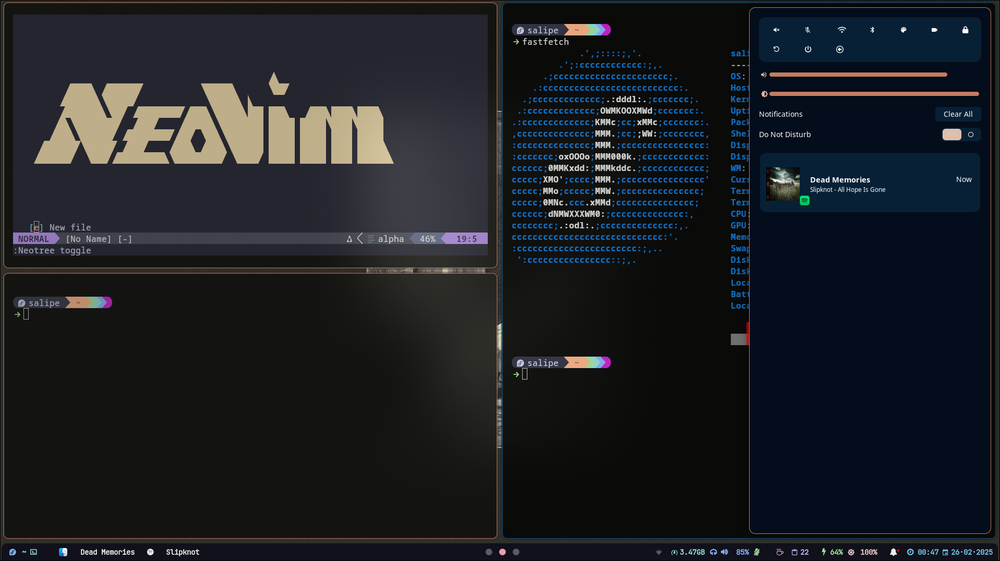

# Dot files for Hyprland in Fedora

## Used repositories

This configuration was maded using other repositories configuration:

- [Rofi configurations](https://github.com/adi1090x/rofi)
- [Wallpapers](https://github.com/dharmx/walls)
- [Basic Configurations](https://github.com/Abhra00/HyprWal)
- [Hypalando](https://github.com/MizxGaming/Hypalando)

--- 

## Screenshots

|  |  |
|---|---|
|  |  |

## Installed Programs
- Spotify
- Zen Browser
- nm-applet
- blueman-manager
- Rofi
- nemo file-manager
- Waybar
- Hypridle
- Hyprlock
- htop
- Waypaper
- SwayNC
- Pavucontrol
- pamixer
- Obsidian
- cliphist
